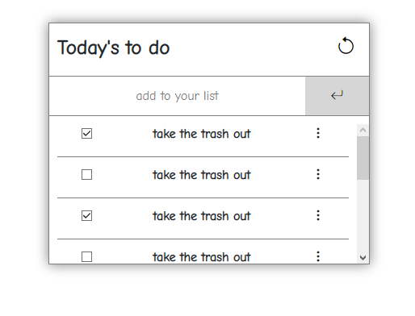

# To do List

> This is a simple to do list where you can add, erase or manage the order of your tasks.



This app is extremely simple but could still be used to manage your daily, weekly or monthly tasks to make your life easier.

Live demo [link](https://jmontanholi.github.io/to_doList)

## Built With

- JavaScript
- Html&Css
- Bootstrap
- Webpack

## Live Demo

To see a live demo of this project please follow the next section "getting started".

## Getting Started

To get a local copy of this program up and running on your local machine follow this sections.

### Prerequisites

* Git and GitHub
* Browser
* Command Line
### Setup

Go to a folder of your choice with the following command ```cd directory_of_choice```.

Then use the following command ```git clone https://github.com/jmontanholi/to_doList.git``` to clone the repository to your folder.
### Install

With the repository already cloned into your local machine you need to run the following command in order to install the dependencies:

```npm install```
### Usage

In order to see the live demo and use the program please run the following command:

```npm start```

> note: this should prompt you to the website, if this is not working try to change ```port:3000``` to ```port:8080``` in webpack.config.js

## Authors

👤 **João Vítor Montanholi Nunes**

- GitHub: [jmontanholi](https://github.com/jmontanholi)
- Twitter: [MontanholiNunes](https://twitter.com/MontanholiNunes)
- LinkedIn: [Joao vitor montanholi](https://www.linkedin.com/in/joaovitormontanholi/)

## 🤝 Contributing

Contributions, issues, and feature requests are welcome!

Feel free to check the [issues page](../../issues/).

## Show your support

Give a ⭐️ if you like this project!

## Acknowledgments

- Webpack documentation
- Microverse
- Bootstrap

## 📝 License

This project is [MIT](./MIT.md) licensed.
